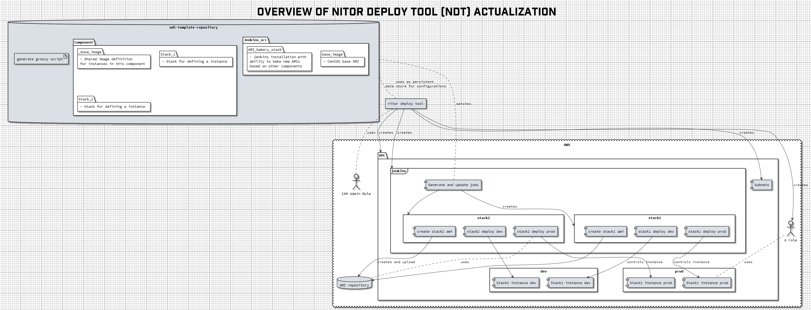

# Nitor Deploy tools - AWS Project template

Template project for projects that use Amazon Web Service (AWS) as an
environment and Nitor Deploy Tools (NDT) for tooling. This repository
is a template that can be used to start new AWS infra project into own
account.

## Overview



Folders in root level describe components in the virtual private cloud
(VPC). Each folder contains different stacks that are baked into image
that is defined in the component root level (`image` sub folder).

Properties files are applied to environment in order of least to most
specific, i.e. project root is first and stack-branch properties
last. Naturally, last one wins.

This repository contains bootstrapping scripts and manuals that one
can 'quickly' setup a project components into AWS.

### Overview of required properties and existing configuration files

This project template has defined only required property files and
required properties into this project. Descriptions of required
properties are distributed into these properties files. To share
custom properties in the component hierarchy, define them in these
files.

Properties in these files should be distributed like the components
are, i.e. component specific properties should be in component
specific properties files. One of the benifits is that it makes
understanding and maintanance of your project infra easier.

## Setup

Setuping contains item that needs to created manually into AWS that
tooling can be bootstrapped, ndt tooling setup and intializing project
stacks that one can start implement project specific components.

Prequisite:
  * `python < 3.0`
  * `nitor-deploy-tools` (in pip)
  * `ansible` (in pip)
    * ansible needs `boto`

Protip: add following shell function to suitable place, to get
autocompletion working.

```shell
if command -v nitor-dt-register-complete > /dev/null 2>&1; then
    eval "$(nitor-dt-register-complete)"
fi
```

### Setup new AWS account

Project template is designed to deploy the technology stack into
already created AWS account with user that has administration
priviliges.

 1. Create AWS account (if needed)
 2. Create IAM user with AdministrativeAccess permissions. *Remember
    to gather access key secrets.*
 3. Setup ndt with command `ndt setup-cli`
	1. Profile name is id to this account access in your local machine
    2. key ID and secrects are those that you created to in previous step
    3. Default region is in format of AWS labeling (i.e. eu-central-1 etc)
 4. Now you should have project profile sourceable in `~/bin/<profile-name>`

Now you should have programmatic access to your AWS account where the
stack can be deployed.

### Setup bootstrap stacks

NDT provides bootstrapping scripts to generate required stacks for
deploying rest of the components.

  1. Create network stack with command `ndt setup-networks`. NDT
     proposes defaults and provides possibility deploy it once it has
     gathered configurations.
  2. Run `vault -i` to create nitor-vault stack into your AWS
     account. This creates a CloudFormation stack where one can store
     and retrieve shared secters.
  3. Create needed baking roles into project with following command
     `ndt setup-bakery-roles`.
	 - TODO not yet implemented into NDT, currently part of this
        template project.
  4. This template requires that one dns zone is configured for the
     AWS account. Do this in route53 and set domain into
     `infra.properties`.
  5. Create necessary keypair(s) for accessing instance(s).
	 - Protip: `aws ec2 create-key-pair --key-name <keyname> | jq -r .KeyMaterial > ~/.ssh/<keyname-private>.pem`

After successful run, you should now have required stacks (network,
vault, bakery-roles) formed into CloudFormation, stack configurations
generated into `bootstrap` folder, dns zone setup and necessary
instance keys.

### Setup project Jenkins

Project template contains jenkins component which role is to act as an
baking platform for the other components in the pool. It will provide
required CI tools that are needed to bake rest of the component that
are defined in the project.

  1. Reserve a one elastic IP to be assigned for jenkins.
  2. Go and modify values in `bakery/stack-jenkins` to match values
     for dns zone and eip what you have defined.
  2. Bake jenkins itself with `ndt bake-image jenkins jenkins-bakery`
     (where jenkins refers to component and jenkins-bakery to the
     stack).
  3. After baking we can deploy the jenkins stack with command `ndt
     deploy-stack jenkins jenkins-bakery`
  4. Now you should go and assign reserved elastic IP into newly
     created instance
  5. Access Jenkins instance and install plugins required for baking:
     * `Process job DSLs`

### Setup components of the stack to bakery

Now that AWS project has been bootsrapped you can start baking and
deploying rest of the components in the stack. For the component to be
deployed one needs to create a new 'freestyle' type of jenkins
job. This job then will take this repository as input and use 'Process
JOB DSLs' plugin to scrape through repository and create views and
jobs for each stack that representend in the repository. Magic is done
in `generate_jobs.groovy` which lays in the root of the project and
will be given as input to the DSL task.

First baking will require permission granting for the job from
'scriptApproval' section in the jenkins.

After first succesful run of the bake recipies generation job, jenkins
will have view named `JENKINS_JOB_PREFIX`. Each branch that wanted to
be built must have corresponding`infra-branchname.properties` file
present.

Now changes into project files will trigger modification job that
modify created jobs, meaning that history of the job is presevered.

Following these instructions you should have succesfully bootstrapped
your project, such that it should be possible to bake images from
different branches and deploy them into AWS.
